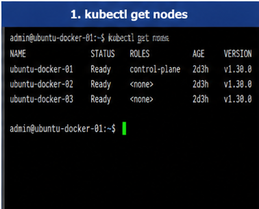
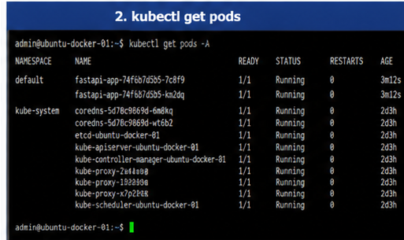
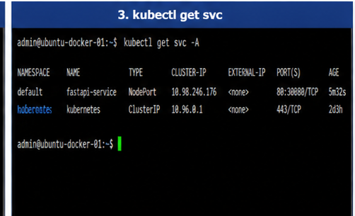
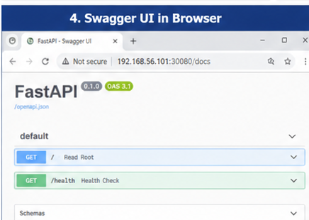
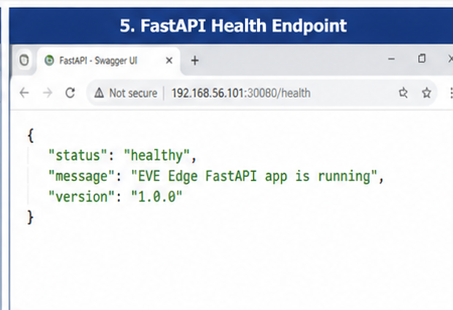
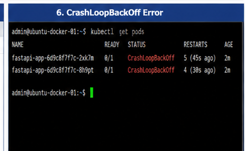
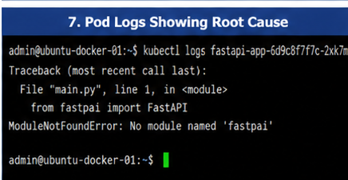
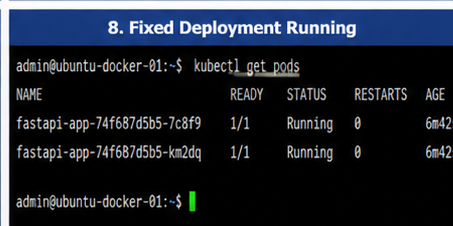
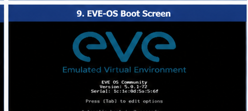
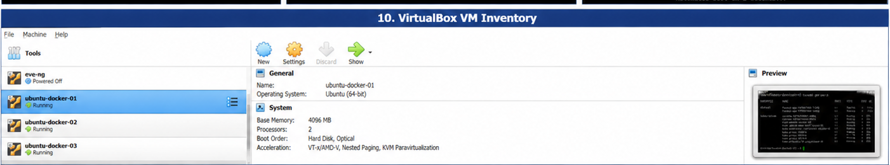

# Enterprise Edge Kubernetes Lab

## Overview

This project is a hands-on edge computing and kubernetes lab built to simulate real-world infrastructure operationsnused in cloud, Linux, administration, and
ZEDEDA-style edge environments.

The lab includes:

-Linux administration and troubleshooting
-Docker containerization
-Kubernetes using K3s
-FastAPI application with Swagger UI
-NodePort service exposure
-Microservice simulation
-CrashLoopBackOff troubleshooting
-EVE-OS edge virtualization lab foundation
-VirtualBox networking and port forwarding

## Key Achievements
- Deployed API into Kubernetes
- Exposed services externally
- Debugged CrashLoopBackOff issues
- Fixed container build errors
- Configured networking between host and VM

## Lab Architecture

Windows Host
-VirtualBox
-Browser access to exposed services

Ubuntu-Docker-01 VM
-Docker
-K3s Kubernetes
-FastAPI app
-Microservice workload
-NodePort services

EVE-OS-Node-01 VM
-EVE-OS edge virtualization platform
-Edge hypervisor layer
-ZEDEDA-style edge node simulation

## Technologies Used

-Linux Ubuntu Server
-Docker
-Kubernetes / K3s
-FastAPI
-Swagger UI
-Python
-Flask
-VirtualBox
-EVE-OS
-kubectl
-journalctl
-curl

## Key Skills Demonstrated

-Kubernetes deployment and troubleshooting
-Docker image build and import into K3s
-API deployment using FastAPI and Swagger
-Linux service troubleshooting
-CrashLoopBackOff root cause analysis
-NodePort networking
-VirtualBox NAT port forwarding
-Edge computing architecture concepts

## Project Highlights

-Built a working Kubernetes lab inside a Linux VM.
-Deployed a FastAPI application into Kubernetes
-Exposed Swagger UI through NodePort and VirtualBox port forwarding.
-Diagnosed and fixed a CrashLoopBackOff caused by a Python module typo.
-Created an EVE-OS VM to simulate an edge virtualization node.
-Documented troubleshooting steps and recovery procedures.

## Screenshots

Screenshots are stored in the '/screenshots' folder.

## 📸 Screenshots

### Kubernetes Nodes

### Kubernetes Pods

### Services

### Swagger UI

### FastAPI Health

### CrashLoopBackOff Error

### Root Cause Logs

### Fixed Deployment

### EVE-OS Boot

### VirtualBox Setup

## 🔍 Troubleshooting Highlight

Resolved a CrashLoopBackOff caused by a Python import error:

Before:
from fastpai import FastAPI

After:
from fastapi import FastAPI

##   Resume Summary

Built an enterprise edge computing lab using EVE-OS, Docker, K3s Kubernetes, FastAPI, and Swagger. Deployed containerized microservice, exposed APIs through NodePort, 
configured VirtualBox networking, and diagnosed Kubernetes CrashLoopBackOff failures using kubectl logs, pod descriptions, and image rebuilds.

